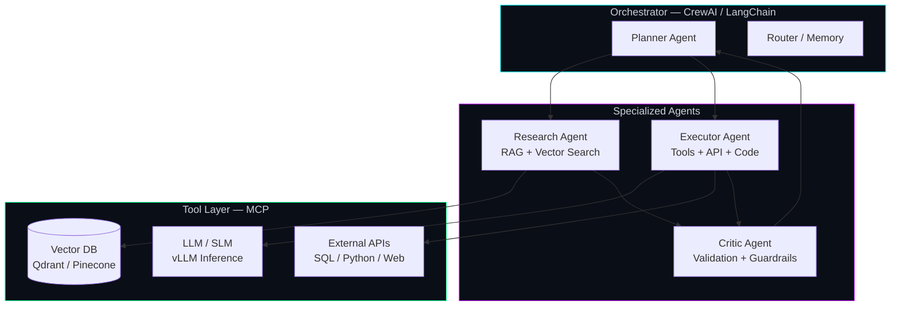

<!-- Mohammad Sadegh Abbaszadeh | AI Engineer Profile -->

<div align="center">


**AI Engineer & Principal Data Scientist**

*Neural Systems | Agentic AI | Production LLMs | MLOps*

<br/>


<br/>

[](https://www.linkedin.com/in/msabbaszadeh)
[](mailto:msabbaszadeh1997@gmail.com)
[](https://github.com/msabbaszadeh)

</div>

---

## Deep Neural Network

Principal Data Scientist with **7+ years** building ML and LLM systems across **Fintech, HealthTech, and Insurance**. I architect neural pipelines from raw data to production inference.


```
  SENSORY INPUT          HIDDEN LAYERS              ACTIVATION        INFERENCE
       o                    o   o   o                  o o o            (AI)
      /|\      synapse     /|  /|  /|      signal      \|/|/      -->   core
   o--o--o--o-----------> o-o-o-o-o-o ----------------> o-o-o ---------> [*]
```

| Layer | What I build |
|-------|-------------|
| **Generative AI** | RAG, fine-tuning, CPT, DPO, RLHF, LLM-to-SLM distillation |
| **Inference** | vLLM, GGUF/AWQ quantization, low-latency neural serving |
| **MLOps** | MLflow, Kubernetes, Docker, CI/CD on AWS / GCP / Azure |
| **Classical ML** | XGBoost, survival analysis, fraud/risk engines, A/B testing |

---

## Agentic AI Systems

I design **autonomous multi-agent workflows** that plan, execute, validate, and iterate — not just single-shot LLM calls.




**Stack:** CrewAI · LangChain · MCP (Model Context Protocol) · Tool Design · Agent Memory · Human-in-the-loop

**Current work @ Vortem:** translating SOTA agentic architectures into production commercial systems with rigorous benchmarking and MLOps lifecycle management.

---

## Tech Stack

<div align="center">


</div>

`LangChain` · `CrewAI` · `vLLM` · `RAG` · `Qdrant` · `Pinecone` · `Spark` · `Airflow` · `MLflow` · `XGBoost`

---

## Featured Projects

| | Project | Description |
|---|---------|-------------|
| **RAG** | [**Electron**](https://github.com/msabbaszadeh/Electron) | Open-source recommendation engine — vector search, embeddings, LLM personalization |
| **ML** | [**Cardiovascular ML**](https://github.com/msabbaszadeh/Machine-learning-DNN-ETC-on-cardiovascular-disease-patients-data) | Predictive modeling on 300K+ patient records — DNN, ensembles, survival analysis |
| **Prod** | **Insurance RAG** *(private)* | Claims automation with custom chunking + vector indexing — **+12% throughput** |
| **Lab** | [**Diabetes SVM**](https://github.com/msabbaszadeh/diabets-analysis-SVM-model) | Classical ML experiments and health analytics notebooks |

> Enterprise agentic pipelines and MLOps systems live in private repos — available for architecture walkthroughs in interviews.

---

## GitHub Activity

<div align="center">


</div>

---

## Currently Building

- Multi-agent orchestration with **CrewAI** and **MCP**
- LLM distillation and quantization for edge inference
- Production RAG evaluation and observability

---

<div align="center">

**AI Team Lead @ Vortem** · Tehran, Iran · Open to remote

*Neurons fire. Agents collaborate. Systems scale.*

<br/>


</div>
