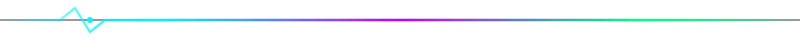
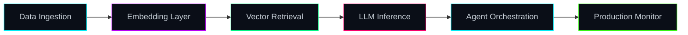

<!-- Dark Neon AI Engineer Profile | Mohammad Sadegh Abbaszadeh -->


<p align="center">
  
</p>

<p align="center">
  
</p>

<p align="center">
  <a href="https://www.linkedin.com/in/msabbaszadeh">
    
  </a>
  <a href="mailto:msabbaszadeh1997@gmail.com">
    
  </a>
  <a href="https://github.com/msabbaszadeh">
    
  </a>
  
  
</p>



<p align="left">
  
</p>

```yaml
role:        AI Team Lead | Principal Data Scientist
company:     Vortem
focus:       Generative AI | Agentic Systems | MLOps
experience:  7+ years | Fintech | HealthTech | Insurance
philosophy:  "Models learn patterns - I architect systems that learn from production."
```

Principal AI engineer who lives at the intersection of **deep learning**, **language models**, and **real-world deployment**. I design neural pipelines that don't just train - they **infer, adapt, and scale** in production.

| Domain | What I Build |
|:------:|:-------------|
| **Generative AI** | RAG, fine-tuning, CPT, DPO, RLHF, LLM to SLM distillation |
| **Agentic AI** | CrewAI, LangChain, MCP, autonomous multi-agent workflows |
| **Inference** | vLLM, GGUF/AWQ quantization, low-latency neural serving |
| **MLOps** | MLflow, Kubernetes, Docker, CI/CD on AWS / GCP / Azure |
| **Classical ML** | XGBoost, survival analysis, fraud/risk engines, A/B testing |


<p align="left">
  
</p>

<p align="center">
  
</p>

<p align="center">
  
  
  
  
  
  
  
  
  
  
</p>


<p align="left">
  
</p>

<table>
  <tr>
    <td width="50%" valign="top">
      <h3><a href="https://github.com/msabbaszadeh/Electron">Electron</a></h3>
      <p>Open-source <strong>RAG-powered recommendation engine</strong> - vector search, embeddings, and LLM personalization.</p>
      <p>
        
        
        
        
      </p>
    </td>
    <td width="50%" valign="top">
      <h3>Enterprise ML Portfolio</h3>
      <p>Health analytics and predictive modeling on <strong>300K+</strong> patient records - DNN, ensemble methods, survival analysis.</p>
      <p>
        <a href="https://github.com/msabbaszadeh/Machine-learning-DNN-ETC-on-cardiovascular-disease-patients-data">
          
        </a>
      </p>
    </td>
  </tr>
  <tr>
    <td width="50%" valign="top">
      <h3>Production RAG - Insurance</h3>
      <p>Claims document automation with custom chunking and vector indexing - <strong>+12% throughput</strong> in production. <em>(Private repo)</em></p>
      <p>
        
        
        
      </p>
    </td>
    <td width="50%" valign="top">
      <h3>Classical ML Lab</h3>
      <p>Diabetes SVM, kidney stone classification, deep learning notebooks - foundational ML experiments.</p>
      <p>
        <a href="https://github.com/msabbaszadeh/diabets-analysis-SVM-model">
          
        </a>
        <a href="https://github.com/msabbaszadeh?tab=repositories">
          
        </a>
      </p>
    </td>
  </tr>
</table>

> **Note:** Most enterprise neural pipelines (agentic AI, MLOps, production RAG) live in **private repos**. Happy to walk through architecture and impact in conversations.


<p align="left">
  
</p>

<p align="center">
  
  
</p>

<p align="center">
  
</p>


<p align="left">
  
</p>



- Multi-agent orchestration with **CrewAI** and **MCP**
- LLM distillation and quantization for edge neural inference
- Production RAG evaluation and observability frameworks


<p align="center">
  
</p>

<p align="center">
  <i>Neurons fire. Models learn. Systems scale.</i>
</p>
