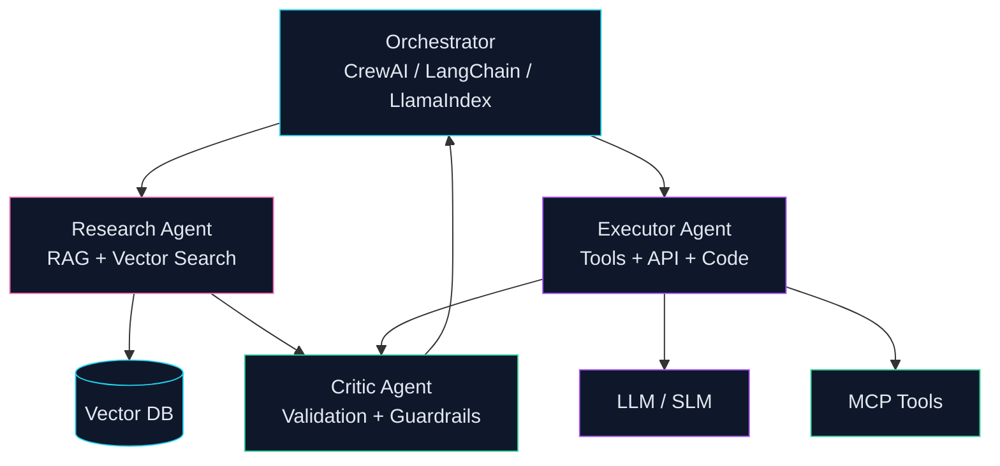

# Mohammad Sadegh Abbaszadeh

**AI Team Lead | Principal Data Scientist**

Building production ML/LLM systems — foundation models, agentic AI, RAG pipelines, and LLMOps — for Fintech, HealthTech, and Insurance.

 

 

---

## About

Principal AI engineer with **7+ years** shipping production ML and LLM systems from research to business impact. Full stack: **deep learning (PyTorch, TensorFlow)**, **NLP & generative AI**, **RAG & foundation models**, **reinforcement learning & post-training**, **agentic orchestration**, and **MLOps / LLMOps on Kubernetes**.

Currently **AI Team Lead @ Vortem**. Previously Lead Data Scientist @ Dojtech and Senior Data Scientist @ TechTap.

---

## Neural Systems

I design end-to-end ML pipelines: data ingestion, model training, batch/real-time inference, evaluation, and production monitoring.

| Focus | Production capabilities |
|-------|------------------------|
| Generative AI & LLM | Foundation models, RAG, fine-tuning, CPT, DPO, RLHF, post-training alignment, distillation, prompt engineering, Hugging Face |
| Deep Learning & RL | PyTorch, TensorFlow, reinforcement learning, on-policy alignment, representation learning, NLP |
| Inference & Ops | vLLM, GPU inference, quantization/compression (GGUF/AWQ), LLMOps, MLflow, Kubernetes, Docker, Terraform, CI/CD on AWS / GCP / Azure |
| Classical ML | scikit-learn, XGBoost, statistics, optimization, survival analysis, fraud/risk engines, A/B testing |

---

## Agentic AI

I build **autonomous multi-agent systems** with tool use, semantic search, and evaluation frameworks — systems that plan, retrieve, execute, validate, and iterate, not one-shot prompt chains.

| Agent | Role | Tools |
|-------|------|-------|
| **Research Agent** | Retrieves context via RAG, semantic & similarity search | Vector DBs, Pinecone, Qdrant |
| **Executor Agent** | Calls APIs, runs code, executes business logic | Python, SQL, REST, MCP |
| **Critic Agent** | Validates quality, safety, and responsible AI compliance | Guardrails, model evaluation |
| **Orchestrator** | Routes tasks, manages memory, coordinates agents | CrewAI, LangChain, LlamaIndex |

**Stack:** CrewAI, LangChain, LlamaIndex, MCP, prompt engineering, guardrails, LLMOps, human-in-the-loop workflows.

---

## Tech Stack

---

## Selected Work

| Type | Project | Impact |
|------|---------|--------|
| RAG | [**Electron**](https://github.com/msabbaszadeh/Electron) | Recommendation engine with vector search, semantic retrieval, and LLM personalization |
| DL | [**Cardiovascular ML**](https://github.com/msabbaszadeh/Machine-learning-DNN-ETC-on-cardiovascular-disease-patients-data) | Deep learning & predictive modeling on 300K+ patient records (PyTorch, TensorFlow) |
| Prod | **Insurance RAG** *(private)* | Production LLM pipeline — custom chunking, model evaluation, claims automation (**+12% throughput**) |
| ML | [**Diabetes SVM**](https://github.com/msabbaszadeh/diabets-analysis-SVM-model) | Classical ML, statistics, and health analytics notebooks |

> Most enterprise agentic AI, LLMOps, and production ML systems are in private repositories. Architecture walkthroughs are available on request.

---

## GitHub Activity

---

**Tehran, Iran** | Open to remote opportunities

*Neurons learn patterns. Agents execute workflows. Systems deliver ROI.*

