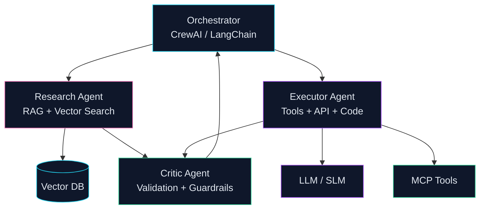

# Mohammad Sadegh Abbaszadeh

**AI Team Lead | Principal Data Scientist**

Building production neural systems, agentic AI workflows, and LLM platforms for Fintech, HealthTech, and Insurance.

 

 

---

## About

Principal AI engineer with **7+ years** of experience shipping high-impact ML and LLM systems. I work across the full stack: **deep learning**, **RAG**, **multi-agent orchestration**, and **MLOps on Kubernetes**.

Currently **AI Team Lead @ Vortem**. Previously Lead Data Scientist @ Dojtech and Senior Data Scientist @ TechTap.

---

## Neural Systems

I design end-to-end learning pipelines: feature ingestion, representation learning, inference, and monitoring in production.

| Focus | Production capabilities |
|-------|------------------------|
| Generative AI | RAG, fine-tuning, CPT, DPO, RLHF, LLM-to-SLM distillation |
| Inference | vLLM, GGUF/AWQ quantization, low-latency serving |
| MLOps | MLflow, Kubernetes, Docker, CI/CD on AWS / GCP / Azure |
| Classical ML | XGBoost, survival analysis, fraud/risk engines, A/B testing |

---

## Agentic AI

I build **autonomous multi-agent systems** that plan, retrieve, execute tools, validate outputs, and iterate - not one-shot prompt chains.

| Agent | Role | Tools |
|-------|------|-------|
| **Research Agent** | Retrieves context from documents and vector stores | RAG, Pinecone, Qdrant |
| **Executor Agent** | Calls APIs, runs code, executes business logic | Python, SQL, REST, MCP |
| **Critic Agent** | Validates quality, safety, and output correctness | Guardrails, eval loops |
| **Orchestrator** | Routes tasks, manages memory, coordinates agents | CrewAI, LangChain |

**Stack:** CrewAI, LangChain, MCP, tool design, agent memory, human-in-the-loop workflows.

---

## Tech Stack

---

## Selected Work

| Type | Project | Impact |
|------|---------|--------|
| RAG | [**Electron**](https://github.com/msabbaszadeh/Electron) | Open-source recommendation engine with vector search and LLM personalization |
| ML | [**Cardiovascular ML**](https://github.com/msabbaszadeh/Machine-learning-DNN-ETC-on-cardiovascular-disease-patients-data) | Predictive modeling on 300K+ patient records |
| Prod | **Insurance RAG** *(private)* | Claims automation with custom chunking - **+12% throughput** |
| Lab | [**Diabetes SVM**](https://github.com/msabbaszadeh/diabets-analysis-SVM-model) | Health analytics and classical ML notebooks |

> Most enterprise agentic and MLOps systems are in private repositories. Architecture walkthroughs are available on request.

---

## GitHub Activity

---

**Tehran, Iran** | Open to remote opportunities

*Neurons learn patterns. Agents execute workflows. Systems deliver ROI.*

